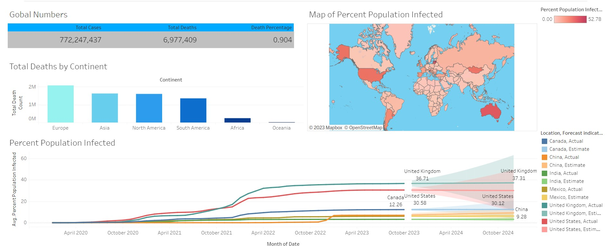
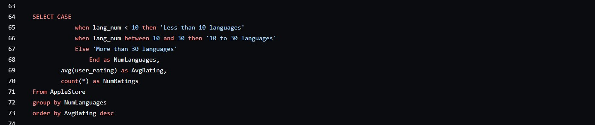

# Andrew Eide

### Technical Skills: SQL, Excel, Python, Tableau

## Education
### Grand Canyon University (_2023-2025_)
 - Bachelor of Science in Business Analytics
 - 4.0 GPA

### Chemeketa Community College (_2021-2023_)
 - Associate of Science in Business
 - 4.0 GPA
 - Baseball Team, 2 Years

## Projects
### Covid Exploratory Data Analysis and Visualization
- Used SQL to perform exploratory data analysis and gain valuable insights on a covid data set
- Imported queries into tableau to create a visualization of the important data

[Code](https://github.com/andreweide541/Covid-Data-Analysis/blob/e87830a570f9335b76bcb3d8ff4d9e14fa789db5/SQLQuery2.sql#L1)

[Visualization](https://public.tableau.com/app/profile/andrew.eide/viz/CovidVisualizationDashboard_17016465788660/Dashboard1#1)

### App Store Exploratory Data Analysis
- Analyzed a data set of thousands of apps on the app store with SQL
- Used the data analysis to determine what kinds of apps would be most successful if developed

[Code](41/App-Store-Data-Analysis/blob/572c4f73c697761bb5f262bdc478c93e76a1ef23/SQLite.sql#L1)

### Excel Road Accident Data Analysis
- Used pivot tables to gain insight and answer key questions about the data set
- Combined the pivot tables to create a clean, interactive dashboard that shows valuable information about the data set

